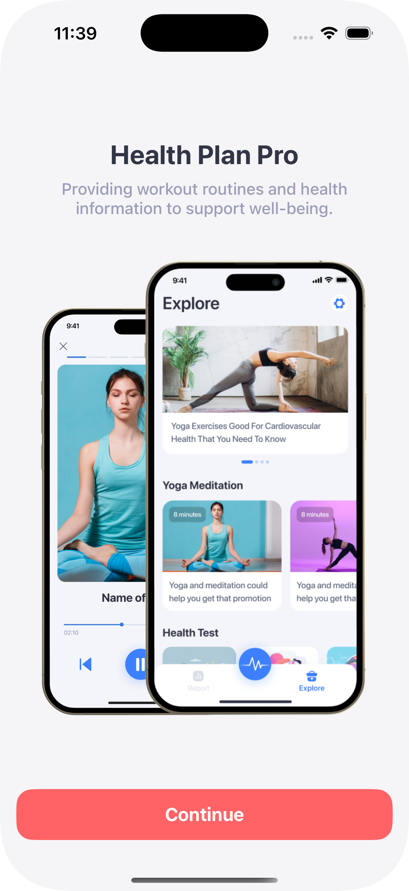
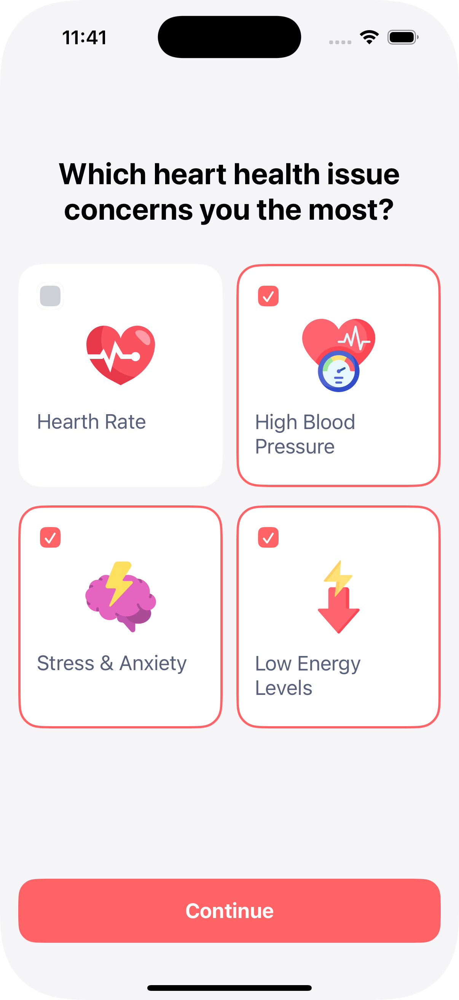
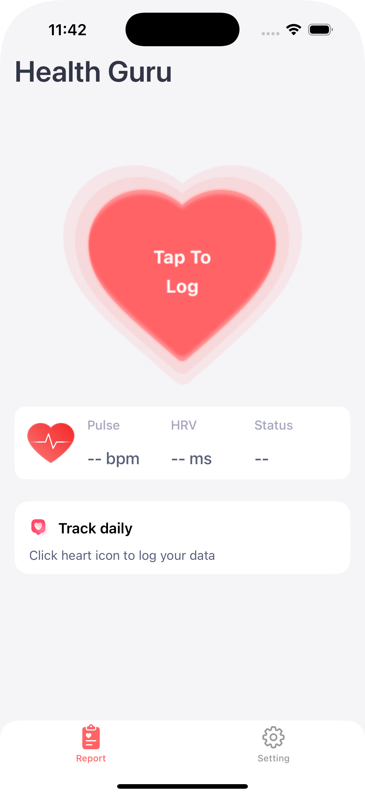
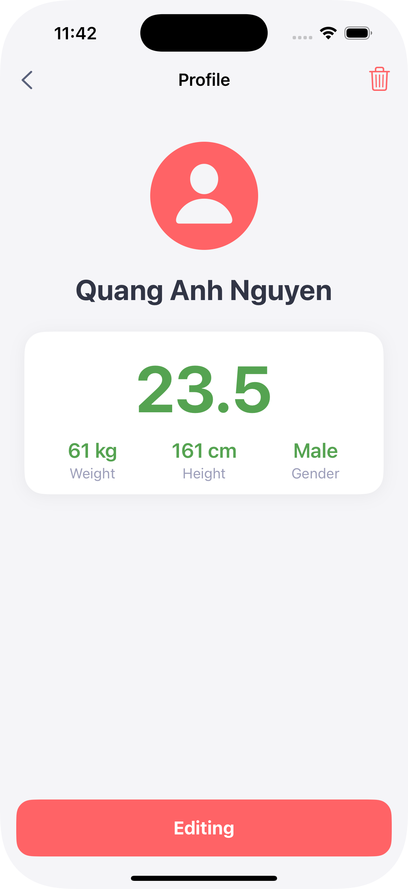

# Health Guru - iOS App

<div align="center">
  
  
  **Your Personal Health Companion**
  
  [](https://developer.apple.com/ios/)
  [](https://swift.org/)
  [](https://developer.apple.com/xcode/)
</div>

## 📱 Overview

Health Guru is a comprehensive iOS application designed to help users monitor and improve their heart health through pulse and HRV (Heart Rate Variability) tracking. The app provides personalized health insights, workout routines, and educational content to support overall well-being.

## ✨ Features

### 🏥 Health Monitoring
- **Pulse Tracking**: Monitor your heart rate with real-time status indicators
- **HRV Analysis**: Track Heart Rate Variability for stress and recovery insights
- **Health Status**: Automatic classification (Good, Low, Warning) based on medical standards
- **Data Persistence**: Secure local storage using UserDefaults

### 👤 User Profile Management
- **Personal Information**: Store and manage user profiles with BMI calculation
- **Health Metrics**: Track weight, height, and gender for personalized insights
- **Profile Editing**: Easy profile updates with validation

### 📊 Health Reports
- **Visual Data Display**: Clean, intuitive interface for health metrics
- **Historical Tracking**: View past entries with swipe-to-delete functionality
- **Status Indicators**: Color-coded health status for quick assessment

### 🎯 Personalized Experience
- **Onboarding Flow**: Guided introduction to app features
- **Health Goals**: Customizable health objectives and plans
- **Educational Content**: Health information and workout routines

### ⚙️ Settings & Customization
- **App Preferences**: Language, notifications, and app icon settings
- **Premium Features**: Enhanced functionality and advanced analytics
- **Feedback System**: Rate app and provide feedback

## 🏗️ Project Structure

```
Quang_Anh_Final_Project_UseXib/
├── App/
│   ├── AppDelegate.swift
│   └── SceneDelegate.swift
├── Controller/
│   ├── Introduction/
│   │   ├── IntroVC.swift
│   │   ├── SelectionVC1.swift
│   │   ├── SelectionVC2.swift
│   │   └── SelectionVC3.swift
│   ├── Premium/
│   │   └── PremiumDetailVC.swift
│   ├── Report/
│   │   ├── LogCollectionView.swift
│   │   └── LogVC.swift
│   ├── Root/
│   │   ├── MainTabBarVC.swift
│   │   ├── ReportVC.swift
│   │   └── SettingsVC.swift
│   ├── Setting/
│   │   ├── MyProfileVC.swift
│   │   └── ProfileVC.swift
│   └── ViewController.swift
├── Model/
│   ├── Card.swift
│   ├── PulseEntry.swift
│   ├── Setting.swift
│   └── UserProfile.swift
├── Resources/
│   ├── Assets.xcassets/
│   │   ├── Colors/
│   │   ├── Icons/
│   │   └── Images/
│   └── Info.plist
├── Storyboards/
│   └── Base.lproj/
├── View/
│   ├── Base/
│   │   └── BaseSelectionVC.swift
│   └── Components/
│       ├── Buttons/
│       ├── Cells/
│       └── Views/
└── Quang_Anh_Final_Project_UseXib.xcodeproj/
```

## 🛠️ Tech Stack

- **Language**: Swift 5.0+
- **Platform**: iOS 14.0+
- **Architecture**: MVC (Model-View-Controller)
- **UI Framework**: UIKit
- **Data Storage**: UserDefaults
- **Layout**: Auto Layout with NSLayoutConstraint
- **Design Pattern**: Programmatic UI (No Storyboards)

## 📋 Requirements

- **iOS**: 14.0 or later
- **Xcode**: 15.0 or later
- **Swift**: 5.0 or later
- **Device**: iPhone (Universal)

## 🚀 Installation

1. **Clone the repository**
   ```bash
   git clone https://github.com/yourusername/health-guru-ios.git
   cd health-guru-ios
   ```

2. **Open in Xcode**
   ```bash
   open Quang_Anh_Final_Project_UseXib.xcodeproj
   ```

3. **Build and Run**
   - Select your target device or simulator
   - Press `Cmd + R` to build and run the project

## 📱 Screenshots

<div align="center">
  
  
  
  
</div>

## 🎨 Design System

### Color Palette
- **Primary**: `buttonActive` - Main action buttons
- **Secondary**: `buttonInactive` - Disabled states
- **Background**: `background` - App background
- **Text**: `title`, `subtitle`, `text` - Typography hierarchy
- **Status**: `good`, `low`, `warning` - Health indicators

### Typography
- **Title**: 32pt Semibold
- **Subtitle**: 16pt Medium
- **Body**: 14pt Regular
- **Caption**: 12pt Regular

## 🔧 Code Conventions

### File Organization
- **MARK Comments**: Consistent section organization
- **Naming**: Clear, descriptive names following Swift conventions
- **Structure**: Logical grouping of properties and methods

### UI Components
- **Programmatic UI**: All views created in code
- **Auto Layout**: NSLayoutConstraint for responsive design
- **Reusable Components**: Custom views for consistency

### Data Management
- **UserDefaults**: Local data persistence
- **Codable**: JSON encoding/decoding for data models
- **Validation**: Input validation and error handling

## 📝 TODO

### High Priority
- [ ] Implement Core Data for better data persistence
- [ ] Add health data export functionality
- [ ] Implement push notifications for reminders
- [ ] Add health data visualization charts

### Medium Priority
- [ ] Implement biometric authentication
- [ ] Add Apple Health integration
- [ ] Create widget support
- [ ] Add dark mode support

### Low Priority
- [ ] Implement iCloud sync
- [ ] Add social sharing features
- [ ] Create watchOS companion app
- [ ] Add accessibility improvements

## 🤝 Contributing

We welcome contributions! Please follow these steps:

1. **Fork the repository**
2. **Create a feature branch**
   ```bash
   git checkout -b feature/amazing-feature
   ```
3. **Commit your changes**
   ```bash
   git commit -m 'Add amazing feature'
   ```
4. **Push to the branch**
   ```bash
   git push origin feature/amazing-feature
   ```
5. **Open a Pull Request**

### Code Style Guidelines
- Follow Swift API Design Guidelines
- Use meaningful variable and function names
- Add comments for complex logic
- Maintain consistent formatting
- Write unit tests for new features

## 📄 License

This project is licensed under the MIT License - see the [LICENSE](LICENSE) file for details.

## 👨‍💻 Author

**Nguyễn Quang Anh**
- GitHub: [@quanganh24052004](https://github.com/quanganh24052004)
- Email: anh.nguyenquang24052004.work@gmail.com

## 🙏 Acknowledgments

- Apple for providing excellent iOS development tools
- The Swift community for continuous improvements
- All contributors and testers who helped improve this app

---

<div align="center">
  Made with ❤️ for better health monitoring
  
  **Health Guru** - Your journey to better health starts here
</div>

<!-- Update for commit: OKE NHÉ --> 